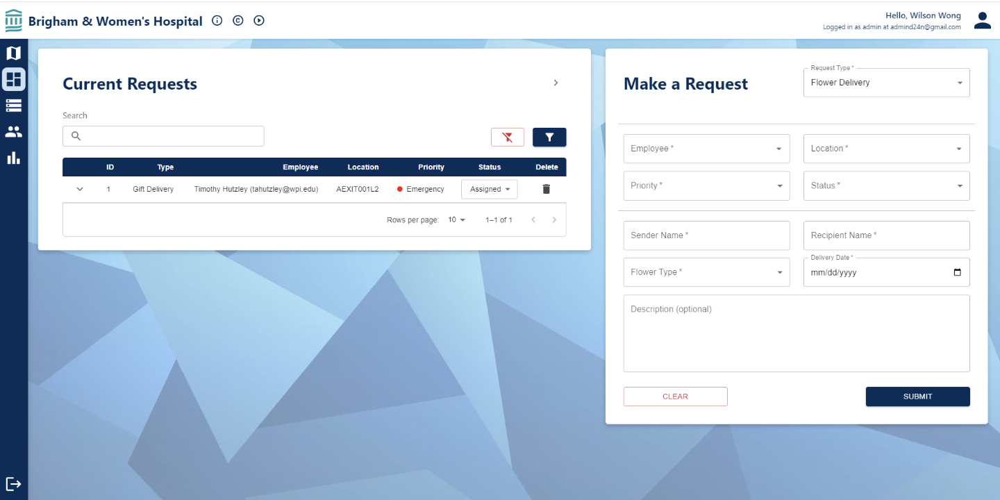
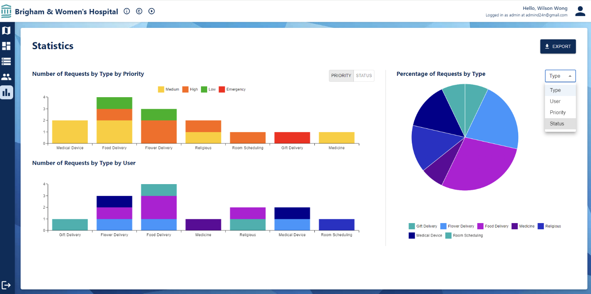

# Brigham and Women's Hospital Pathfinding and Service Management System

This full-stack web application prototype was developed as part of the CS3733 Software Engineering course at Worcester Polytechnic Institute (WPI) in collaboration with Brigham & Women’s Hospital. The project was a team effort involving ten to eleven students applying Agile methodologies, software design patterns, and functional programming over an eight-week period.

## Project Overview

The application is designed to enhance both guest and employee experiences within the hospital environment. It provides features such as secure authentication, interactive pathfinding, service request management, and a map editor for maintaining the hospital layout.

## Key Features

- **User Authentication:**
  - Secure login system for hospital staff and guests.
  - Role-based access to different features, ensuring data security.

- **Guest Pathfinding:**
  - **Interactive Map:** Guests can select two locations within the hospital and receive the shortest path.
  - **Algorithm Options:** Users can choose between various pathfinding algorithms like BFS, DFS, Dijkstra, and A*.
  - **Accessibility:** Routes include options for accessible paths.

- **Service Request Management:**
  - **Dashboard:** Employees can manage and update the status of service requests.
  - **Request Creation:** Staff can create new service requests, specifying details such as type, location, and priority.

- **Database Management:**
  - **Employee Management:** Admins can manage employee data, including adding and editing employee details.
  - **Map Editor:** A tool for maintaining the hospital's layout, allowing employees to add nodes and edges on the map.

- **Statistics and Reporting:**
  - **Service Request Reports:** Visual and statistical reports on service requests by type, priority, and user.

- **High Score Leaderboards:**
  - **Gamification:** Leaderboards track employee performance, adding a competitive element to task completion.

## Development Process

- **Coursework Context:**
  - The project was part of WPI’s rigorous CS3733 Software Engineering course, which required teams to create a web application for an industry collaborator using contemporary software frameworks and tools.

- **Tech Stack:**
  - **Frontend:** React.js, Material UI, Typescript
  - **Backend:** Express.js, Prisma ORM
  - **Database:** PostgreSQL
  - **Deployment:** Docker, AWS EC, AWS RDS

- **Project Role:**
  - **Jose Manuel Perez Jimenez** served as an assistant lead software engineer, contributing significantly to the pathfinding and map-building components of the application. His responsibilities included gathering software requirements, creating UML diagrams, implementing core algorithms, and deploying the application.

## Interface Screenshots

Here are some screenshots of the application in action:

# Engineering and configurations

This document contains an outline of
the entire repo, the tooling in the
repo, and explanations of the provided
tooling, including why it was selected.

Each "package" in this repo also contains a
readme, providing further details on its tooling,
and the reasoning for the tooling it has.

<!-- TOC -->

- [Softeng Starter Code Repo](#softeng-starter-code-repo)
  - [WebStorm Run Configurations](#webstorm-run-configurations)
  - [Installation and Useful Scripts](#installation-and-useful-scripts)
  - [Design Pattern](#design-pattern)
  - [Frontend vs Backend (A Web-Development Overview)](#frontend-vs-backend-a-web-development-overview)
    - [The Hyper-Text Transfer Protocol (HTTP)](#the-hyper-text-transfer-protocol-http)
    - [Using HTTP](#using-http)
  - [Package Overview](#package-overview)
    - [TypeScript](#typescript)
    - [Node.js](#nodejs)
    - [Yarn](#yarn)
    - [Turbo.repo](#turborepo)
    - [ESLint](#eslint)
    - [Prettier](#prettier)
    - [Husky](#husky)
    - [Docker](#docker)
    - [PostgreSQL](#postgresql)
    - [Traefik](#traefik)
    - [Vitest](#vitest)
  - [Miscellaneous](#miscellaneous)
  _ [.run](#run)
  _ [deploy.sh](#deploysh)
  _ [.turbo](#turbo)
  _ [.gitignore](#gitignore)
  _ [Apps](#apps)
  _ [Configs](#configs)
  _ [node_modules](#node_modules)
  _ [Packages](#packages)
  <!-- TOC -->

## WebStorm Run Configurations

Use the provided run configurations - `Start Dev`, `Start Prod`, and
`Debug` (use Debug after `Start Dev`) - to interact with the repo via WebStorm. These configurations
are customized to properly connect the repo to WebStorm. Running files directly,
or outside of these configurations, will have unexpected results.

Using the `Dev` configuration, the development servers will automatically restart when a file change occurs.
If a restart is not occurring, use `CMD + S`/`CTRL + S` to manually save the
file and trigger the restart.

## Installation and Useful Scripts

- Run `yarn install` to install all packages
- Run `yarn build:dev` to build the development environment
- Run `yarn setup` runs the above two commands
- Run `yarn run lint:fix` to validate your code content and style
- Run `yarn run dev` to start the development server
- Run `yarn run deploy` to run the production server
- Run `yarn run dev:stop` to stop the development server
- Run `yarn run deploy:stop` to stop the production server
- Run `yarn sync` commits you current branch, merges the latest main into it, and pushes the result
- Run `yarn fix` to clean the Yarn cache, Turbo cache, and rebuild the development environment which can fix some issues

If your commits are failing, run `yarn run lint` and examine the output to
find the error(s). Address them, and your commit will proceed

## Design Pattern

This repository follows a common one
in modern web-development:
The `monorepo` pattern. In this pattern,
one repository contains multiple "projects".
Generally, (and in this case), these are
one or more applications (for us, the frontend
app and the backend app - more on the difference later),
and packages containing common code between them.
The tooling in this repository is designed arond
making development with this pattern easier and
faster.

## Frontend vs Backend (A Web-Development Overview)

In web development, a server of some sort is needed
to provide the webpage to any browser requesting it.
This typically results in a static file (e.g., a file that never
changes based on the application state) being
sent to the requesting browser. These files are pre-created during development time
and served in a "bundle" (containing `HTML`, `JavaScript`, and `CSS`) that the browser
assembles to create a functional webpage.

In order to create a webpage that interacts with a database of some kind (e.g., to provide
some kind of persistent data storage) a server needs the ability to send content that is not
static (e.g., content that can be modified), and to allow content to be changed.

### The Hyper-Text Transfer Protocol (HTTP)

The protocol that allows both of these to happen is `HTTP` (the Hyper-Text Transfer Protocol), which
allows documents to be sent to webpages. With one more modern exception,
**this is the only way a web-app running in a browser can communicate with servers**. HTTP
supports a few request
type - each of which acts on a "resource". A resource is an idea - not a physical file/object.
You define what a resource is. The only requirement is that it
can be somehow identified consistently (e.g., by a URI - a Uniform Resource Identifier). URLs are a type
of URI, and are typically used in web-development to identify resources.
There is no required pattern for URIs - they just need to be
consistent enough that your frontend can find them, and that there are no duplicates. Resources can
support one or more
of the following request types in HTTP

- GET (e.g., fetch the resource in its current state)
- PUT (e.g., set the resource)
- POST (e.g., submit something to the resource - this generally is used to update a resource
  or send some sort
  of data to the server)
- DELETE (e.g., remove the resource)
- PATCH (e.g., apply some sort of partial modification to the resource)

For more information on HTTP, see https://developer.mozilla.org/en-US/docs/Web/HTTP

### Using HTTP

Historically, both roles were served by `PHP` - it could both statically serve files and
support the other HTTP operations on changeable resources.
In the modern web-development world, `PHP` is considered
legacy - there is modern tooling that does the same
job, is faster, and is easier to work with.

In modern applications, these tasks are typically done separately,
allowing one API (e.g., backend with changeable resources) to be used
with multiple frontends, and to allow the frontend to change
without affecting the backend.

## Package Overview

What follows is a basic overview of the packages in the repo,
and what files they use.

### TypeScript

JavaScript is a dynamically-typed language, meaning it does not need types
explicitly specified in code, as they are determined at runtime.

Unfortunately, that can sometimes complicate development, as your IDE is unable
to provide proper suggestions on method names, object parameters, and more, since it does
not know what type an object will be at runtime.

It can also introduce bugs that would normally be caught at compile-time.

Typescript solves this by requiring that type annotations be placed on variables,
method parameters, and method returns. These are often automatically inferred,
so tedious boilerplate is reduced.

Typescript compiles to JavaScript, catching any type errors in the process.

Typescript is configured by `tsconfig.json`. You **SHOULD NEVER** edit the top-level one
directly, as it simply refers to the typescript config project in `configs`. It exists at the top-level
for the benefit of your IDE, and links to the above project. You probably won't need
to modify the Typescript config at all. Each package contains its own tsconfig.json that
extends the base one, and provides some specific information about its
environment (for instance, web based or client based, and how packages are resolved).

See https://www.typescriptlang.org/docs/ for information on TypeScript and its types.

### Node.js

Node.js is the basis for much of the repository. It is a client-side Javascript runner,
that enables JavaScript code to execute outside a webpage in a browser (much like
other languages, such as Python).

You should never need to directly interact with Node. Yarn will run Node
programs for you.

For details on Node, see https://nodejs.org/dist/latest-v18.x/docs/api/

### Yarn

Yarn is a package manager and task runner for Node.js, enabling fast dependency acquisition and
the bundling of dependencies in Node.js tasks.

Yarn is an alternative to NPM (the Node Package Manager). Yarn was selected over NPM in this
application because it has better support for monorepos, including two key features:

Workspaces (which are essentially the projects in a monorepo) can be defined in a Yarn project.
Dependencies in monorepo workspaces are shared (e.g., installed once at the top level),
and one project can use another as a dependency. NPM's support for both of these is primitive by comparison.
See https://yarnpkg.com/features/workspaces for details on workspaces

Plug'n'Play, which bundles highly compressed dependencies in the monorepo's
GitHub repository. Yarn recommends this configuration, because it improves image build times
(as images do not need to be fetched each time), and it improves the repositories
resilience to bugs in Yarn itself, or dependencies, as they do not need to be fetched
each time.
See https://yarnpkg.com/features/pnp and https://yarnpkg.com/features/zero-installs for details
on Yarn Plug'n'Play.

A few files/folders define a Yarn configuration:

- `package.json`: This defines the project, as Yarn sees it. It includes dependencies,
  development dependencies (dependencies that are not needed for the final build image, but are needed
  for development. This can include testing tools, code quality tools, or deployment tools). It also defines
  a projects workspaces, scripts (tasks Yarn can run), and some other miscellaneous
  information. You may need to edit this file at some point. Note that every workspace will need its own
  package.json, to define
  its dependencies and scripts. Packages and scripts are not inherited from the root of a monorepo. To reference
  another workspace as a package, import it normally (workspace name), and then
  use "workspace:\*" as the version. Examples of this are in the repo.
  See https://yarnpkg.com/configuration/manifest for details on how to modify your package.json files.
- `yarn.lock`: This contains the tree of dependencies your monorepo needs.
  You should **NEVER MODIFY THIS FILE DIRECTLY**, as it is meant to be auto-generated by Yarn.
- `.yarnrc.yml` contains some basic information about Yarn's internal settings, such
  as supported architectures/operating systems, the build system to use, and a few other miscellaneous
  configuration
  options. You probably won't need to modify this file.
  See https://yarnpkg.com/configuration/yarnrc for details on the file
- `.pnp.cjs` and `.pnp.loader.mjs`: These are part of the internal
  workings of the Yarn Plug'n'Play setup. You **SHOULD NOT** modify these files, or add them to your
  `.gitignore`.
- `.yarn`: This is where the Yarn cache is, meaning your actual packages are stored here.
  Some parts of this folder are in the `.gitignore`, while others are not. Do NOT modify
  which parts are and which aren't, or the Yarn Plug'n'Play setup will break. Do NOT modify anything in this folder
  directly.

Here are a few useful Yarn commands:

- `yarn run <script>` will run the provided Yarn script from the root
- `yarn add <package> [--dev]` will add the provided package to Yarn, and install it
- `yarn install [--immutable] [--immutable-cache] [--check-cache]` will check that Yarn has correctly
  installed everything
  based on your package.json files. Immutable and Immutable-cache set Yarn to validation mode,
  meaning it won't modify your yarn.lock, rather it will verify your yarn.lock (and cache). Check-cache will force a more
  strict check of your Yarn cache. If you think your Yarn configuration is broken,
  delete `yarn.lock` and run `yarn install --check-cache`.

Any of the above commands can be prefixed with `yarn workspace <workspace>` (or you can be
in a workspace folder) to run the command in a specified workspace. Generally, you will only want to run
`yarn install` in this configuration, as top-level packages are rarely useful.

See https://yarnpkg.com/cli/install for more details on the Yarn CLI

### Turbo.repo

Turbo is a task-runner built on-top of Yarn, that enables the caching and
parallelization of tasks, and allows tasks to run in pipelines. Turbo is built around
monorepos, and greatly improves development image size and build speed.

Turbo's config is based in `turbo.json`, which can be nested on a per-project basis.
You probably won't need to directly interact with Turbo, or it's configuration.

It's documentation can be found here https://turbo.build/repo

### ESLint

ESLint is a linter for JavaScript/TypeScript. It checks your code for various quality
issues, and enforces some style guidelines. WebStorm directly integrates with
ESLint, and can give you quality warnings from ESLint directly in your
IDE.

ESLint is defined by its config, `.eslintrc.cjs`. You **SHOULD NEVER** modify the top level
.eslintrc.cjs file. It exists exclusively for the benefit of your IDE, importing the custom
package in `configs`. You probably won't need to modify your ESLint config directly,
but if you want to change your style rules, you can do so there. Each project also contains its own .eslintrc.cjs,
where it specifies some project specific configuration, such as the runtime environment.

Details on ESLint can be found here: https://eslint.org/docs/latest/

### Prettier

Prettier is a style-checker for JavaScript/TypeScript. JavaScript and TypeScript are very
flexible languages, meaning that the same functionality in code can look many ways. This includes
indentation, the presence of semicolons, and how functions are formatted.

Prettier defines a consistent style and ensures your code matches that style.

Prettier is defined by its configuration `.prettierrc.cjs`, which can be found at the root
and at each project. You **SHOULD NOT** modify the top-level or project-level configs directly,
they exist simply so that your IDE understands the prettier configuration. If you want to modify the prettier
configuration to update the style requirements, edit the custom config in the `configs` directory.

See https://prettier.io/docs/en/index.html for details on how to configure Prettier.

### Husky

Husky is a tool that automatically integrates with your `git`, enabling
scripts to automatically be run on certain events (such as attempting to commit).

In this repository, Husky is used to run `yarn run lint:fix` before each commit, which validates your code according to
ESLint, Prettier, and TypeScript. It automatically fixes anything that can
be automatically fixed, and if something needs manual intervention, it will stop
the commit from proceeding. If you have an issue that prevents you from committing,
run `yarn run lint:fix` and examine the output to find the issue.

If you absolutely need to skip the autochecks, you can run `git commit --no-verify`

Husky's config is in `.husky`, with an auto-install script in `package.json`.

You probably won't need to touch your Husky config.

See https://typicode.github.io/husky/ for details.

### Docker

Docker is a tool for containerized code. This basically means, it runs
code in highly-compact Virtual Machines that exist only to run that code.
When the code has finished running, the VMs die and all files that are not explicitly
marked to be saved are deleted from the VM.

This is useful for a few reasons:

1. It ensures a production environment that is always completely consistent
2. It simplifies the production environment
3. It simplifies deployment, as a template for a container (or, an Image) can be
   shared and easily run
4. It keeps the development environment consistent with the production environment
   and across systems
5. It simplifies interactions between multiple programs (for us, the backend, frontend, and database).

The Docker configuration in this repository has a few configurations items:

- `Dockerfile` which provides instructions to Docker to create both production
  and development virtual machine images from the repository state
- `.dockerignore` which defines files that the `Dockerfile` should ignore
- `docker-compose.dev.yaml` which provides instructions to Docker to run the images (and a PostgreSQL database) in
  a re-usable way, and a way that enables your code edits to move to the VM in real-time
- `docker-compose.prod.yaml` which provides instructions to Docker to run the images in a
  re-usable way that creates the smallest possible images
- `docker-compose.test.yaml` which provides instructions to Docker to run images (and a PostgreSQL database) for testing

It is recommended that the Yarn `dev`, `prod`, `test` and their associated `dev:stop`, `prod:stop`, and `test:stop` configurations
be used to start the containers, or the WebStorm run configurations `Start Prod`,
`Start Dev`, and `Start Tests` be used to start the containers.

You should not modify or move any of the Docker files unless you are absolutely sure
you know what you are doing.

See https://docs.docker.com for Docker documentation

### PostgreSQL

PostgreSQL is a modern, highly performant SQL database. It is completely
open-source, and the most widely used SQL database.

In the development environment, the database is accessible via any standard
query console, using the credentials username: "dev", password: "dev", and database: dev on localhost:5432.

In the production environment, the database is **not accessible** outside the Docker
container network. This means that nothing except for your backend code can access the database. This
is how most production databases are configured.

PostgreSQL is configured through `docker-compose....yaml` for both production and development.

See https://www.postgresql.org/docs/ for details on PostgreSQL specific commands

### Traefik

Traefik is a "reverse-proxy"—that means it receives traffic and routes
it to the appropriate place. This is used in production to appropriately route
requests to the frontend or the backend. It also provides automatic TSL (https) configuration
in production, greatly enhancing security.

Traefik can be configured in `docker-compose.prod.yaml`. You probably
shouldn't need to change its configuration.

Details on Traefik can be found here: https://doc.traefik.io/traefik/

### Vitest

Vitest is a JavaScript test-runner. It is extremely fast, and includes
a web-portal to view and manipulate test results. It also can listen for file changes,
and automatically re-run tests based on file changes. Once the test configuration has
started, you can find the test results here: http://localhost:51204/**vitest**/

Vitetest is configured by the following files:

- `vitest.workspace.ts`, which defines where vitest can look for projects that
  will have test files
- `vitest.config.ts` which is the configuration file for vitest.
  Similar to vite in the
  frontend, this requires special file watching options to work in Docker

## Miscellaneous

The following details the remaining files that can be found in the top-level of the repo

### .run

This is a folder used by WebStorm to store the bundled run configurations. **DO NOT modify this
file**.

### deploy.sh

This is a file that contains a script to auto-run and deploy
the production docker containers

### .turbo

This is usually found in subdirectories, and is part of the Turbo.repo caching setup. You shouldn't need to
modfiy these files, but deleting them is OK.

### .gitignore

This defines folders/files that will automatically be excluded
from your Git repository. Don't modify this unless you are sure you know
what you're doing

### Apps

Apps contains the above-described `frontend` and `backend` apps.

### Configs

Configs contains all the custom configurations (`prettier` `eslint`, and `TypeScript`)
described above in the repo. If you want to modify them, use the configs in these folders

### node_modules

This is location NPM installs packages. Some packages (`turbo` and `prettier`, as an example) still use
this as a caching location. Deleting this folder shouldn't have any affect other than
slowing things down temporarily.

### Packages

Packages contains packages that the front/back end rely on, including code
they share. Changes to `Packages` will automatically be reflected in both the front and back ends

## Contact Information

For any questions regarding the project, please contact:

**Wilson Wong, Ph.D.**  
Associate Teaching Professor  
Computer Science Department  
Worcester Polytechnic Institute  
Email: wwong2@wpi.edu
